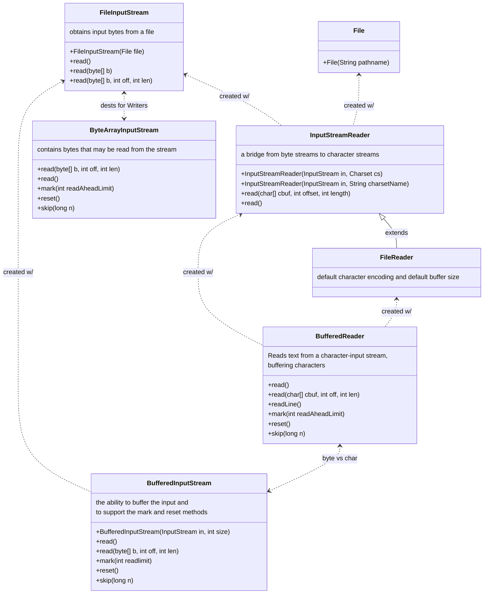
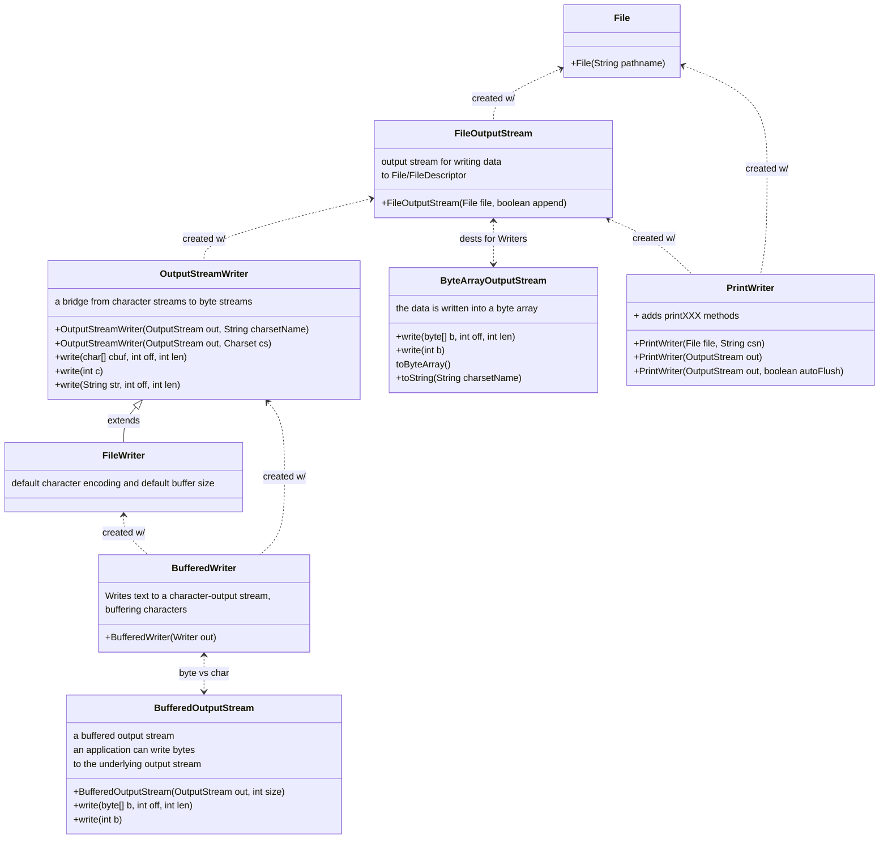

## Why you should ignore this repo.

I put together different ways one can make GET/POST requests pre-java11. This exercise helped to internalize Stream hierarchies in Java.

## I/O

### Reading Streams 

### Writing Streams

